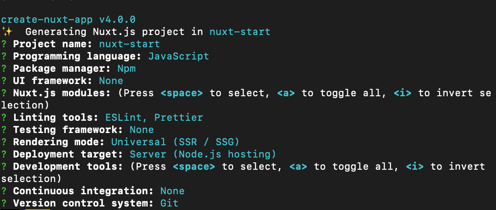
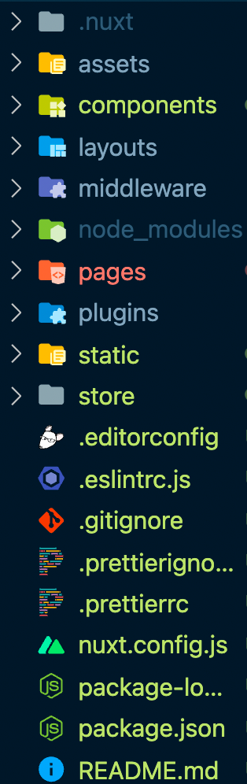
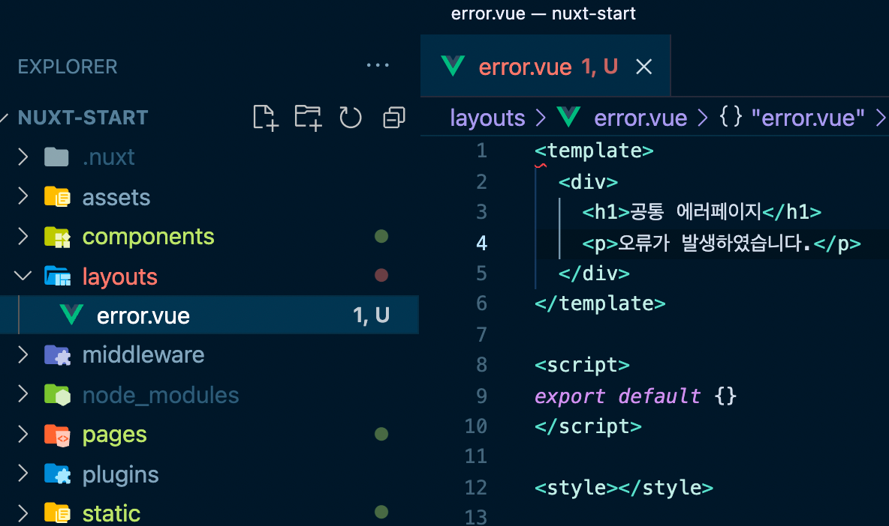
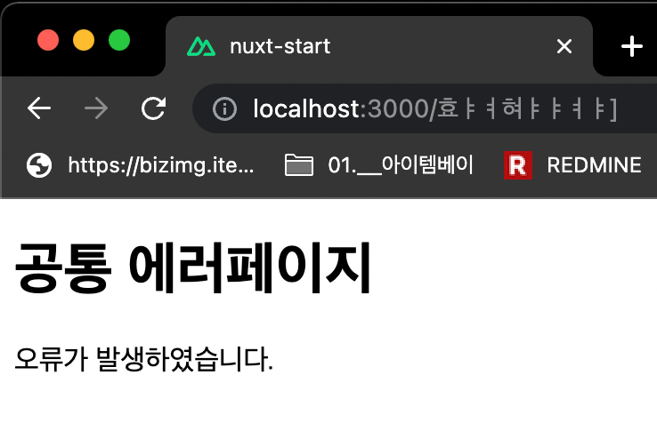
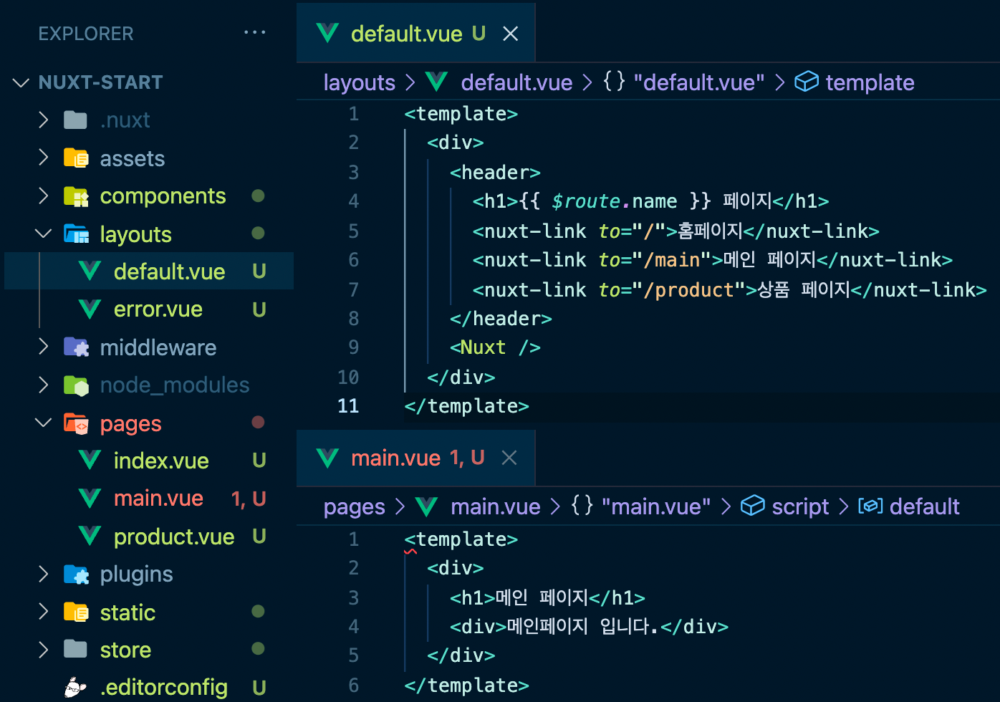

1. Nuxt.js 프로젝트 시작하기
   👉 Nuxt 프로젝트 생성

- https://nuxtjs.org/docs/get-started/installation/
```
    npm init nuxt-app <project-name>
```
Untitled

👉 Nuxt 프로젝트 폴더 구조

2

.nuxt : nuxt 빌드 결과물이 담긴 폴더
.으로 시작되는 것들은 숨김파일/폴더이다.
삭제하고 npm run dev 하면 다시 생성된다. / 수정하면 내용이 다시 변경된다.
.nuxt > router.js :
pages 안에 폴더 혹은 vue 파일 생성 시 router 내용이 자동으로 생성된다
폴더 안에 index.vue로 생성 시 URL : 폴더명으로만 생성됨
3

    ```jsx
    routes: [{
        path: "/main",
        component: _85e5ff24,
        name: "main"
      }, {
        path: "/product",
        component: _15dba94d,
        name: "product"
      }, {
        path: "/test",
        component: _79332ac7,
        name: "test"
      }, {
        path: "/",
        component: _73f02d26,
        name: "index"
      }],
    ```

assets : 일반적인 이미지, CSS, 웹 리소스
components
layouts : 페이지 layout할 때 사용되는 Component들을 정의
middleware : 서버에서 브라우저로 넘기기전에 실행시키는 함수들을 정의
pages : vue 파일 생성 시, 해당 파일명으로 router를 만들어준다.
plugins : Vue 인스턴스 생성되기 전, 공통으로 사용될 라이브러리를 정의,
해당 페이지에서 import 안하고 바로 표시해준다.
store : Vuex
👉 에러페이지 정의 방법

layouts > error.vue 생성 시 오류가 발생하면 해당 페이지를 표시해준다

4

ex) 404 발생 시 해당 페이지 표시

5

👉 레이아웃, 컴포넌트 소개

layouts > default.vue
pages 하위에 있는 파일들의 layout구조를 지정할 수 있다.

default.vue를 아래와 같이 작성하면

부분에 pages 하위 vue 내용이 표시된다.
은 vue-cli에서 페이지 이동 시 사용한 와 기능이 같다.
$route변수를 통해 해당 router의 정보를 확인할 수 있다.
<template>

  <div>
    <header>
      <h1>{{ $route.name }} 페이지</h1>
      <nuxt-link to="/">홈페이지</nuxt-link>
      <nuxt-link to="/main">메인 페이지</nuxt-link>
      <nuxt-link to="/product">상품 페이지</nuxt-link>
    </header>
    <Nuxt />
  </div>
</template>



👉 eslint가 화면에 안먹도록 설정

nuxt.config.js
